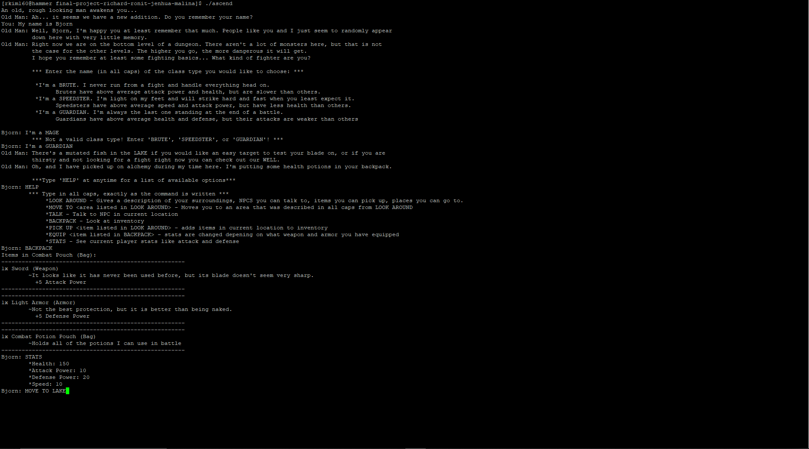

 
# Ashen Ascension
 
Authors: Ronit Bhushan - (https://github.com/rbhus002); Malina Martinez - (https://github.com/mmart505); Jenhua Chang - (https://github.com/jchan434); Richard Kim - (https://github.com/richurros) 

## Project Description
* Why is it important or interesting to you?
  * Our project will be a mystery/dungeon crawl text-based rpg. In the game the user plays as a character that mysteriously finds themselves in a dungeon and must traverse higher and higher to more dangerous levels in an attempt to figure out why they are there and how to get out? In order to traverse these levels of the dungeon, the player must interact with the world in order to find out where to go and they must fight certain enemies.  The reason why this project is important to us is because all of us have had no prior experience with game development so doing this project will give us some experience in game development and give us some insight on whether we like game development or not. The reason why this project is important to us is because we all have experience with playing video games so it will be interesting to learn how to make a video game ourselves.
 * What languages/tools/technologies do you plan to use? (This list may change over the course of the project)
   * C++ - The coding language we will be using
 * What will be the input/output of your project? What are the features that the project provides?
   * Input (Outside of Combat):
     * User can type in commands with certain action keywords that let them interact with the world in the game
     * "PICK up \<item_name\>"
     * "MOVE to \<location_name\>"
     * "TALK to \<NPC_name\>"
     * This allows the user to interact with the world in their own way as long as they use the commands
   * Input (During Combat):
     * The User is given a set of commands they can choose from
     * Consisting of attack, flee, or use an itme within combat
     * as of right now still working on options for combat
   * Output
     * Output during combat would be text that shows the health bar of both the enemies and the player, it shows the set of actions that user can do and its stats if the action has stats, and this output would reprint after every turn to update the health bars and etc. The output would also print out whether an attack was succesful or not.
     * Output outside of combat would basically be text that are descriptions in order to aid the user in visualising the game. After each action text would be written back in response to the user's choice. These descriptions would also help progress the player through the game.
    * The features of this game are that there will be multiple characters to choose from, each with different abilities, stats, flaws, and etc. that make them unique. The player will progres through the dungeon by finding their way to next level by using the hints they find in the world and by fighting various enemeies that they will encounter along the way. The combat system is a turned based combat system, and the player will have the choices to attack, use an item, or flee the battle. Depending on the plater and enemy stats, damage received and dealt will vary accordingly so the plater must strategize each and every turn in order to succeed. The player will have an inventory system that will hold all kinds of items. One type item would be potions that boost stats during battle. Other items would weapons and armor that increase the base stats that the user has so they are stronger in combat. Another type of item would be story relevant items where the item is necessary in order for the player to progress in the game (like a key to a door).

  ## Phase II

 ## Class Diagram
 
 Entity Class:
 - has private attributes: name, maxHealth, atk, defense, spd, dmgTaken
 - getters/setters for each attribute
 - contains virtual functions so inheriting classes must include those functions appropriately. For ecample, Player and Enemy should both have a function to attack,  but they will be slightly different from each other.

 Enemy Class:
 - inherits from Entity Class
 - has private attributes: atkBoost, defBoost, spdBoost (these all determine if the enemy has a boost in a particular stat)
 - attack(Player x) returns a number specifying how much damage is dealt to Player object
 - defend(Player x) allows for the enemy to boost defenses more when taking damage
 - printHealth() prints the current health of the Enemy object

 Player Class:
 - inherits from Entity Class
 - has private attributes: inventory, weaponEq (what weapon is equipped), armorEq(what armor is equipped), playerClass(what class did the user choose for the Player object), location (where the user is currently), combatPt(indicator of how many combat points the user has per turn)
 - printInv() prints out entire inventory
- addToInv/rmFromInv() adds or removes items from inventory vector
- attack(), printHealth(), and defend() all function the same as that in Enemy, adjusting to target Enemy instead of Player
- eqWeapon() and eqArmor() equip weapons and armor respectively
- fleeBattle() allows user to flee a battle (chance based on speed)
- move() indicates where along the story the user can move to
- talkToNPC() allows for user to talk to an NPC if needed

Item Class:
- aggregates to Player class, Player's inventory is an array that holds items
- private attributes: desc(item description), name(item name), itemCount(how much of the item is there)
- printItem() prints out item name, description, and quantity
- getters for name and item count

Weapon Class:
- inherits from Item Class
- Increases Player attack attirbute when equipped
- private attributes: atk(attack stat buff), isEquipped (checks if the item is equipped by Player object)
- eqWeapon() changes bool isEquipped to true

Armor Class:
- inherits from Item Class
-  Increases Player defense attirbute when equipped
- private attributes: def (defense stat buff), isEquipped (checks if the item is equipped by Player object)
- eqArmor() changes bool isEquipped to true

Potion Class:
- inherits from Item Class
- private attributes: attack, health, speed, defense (all act as buffing stats when used up by Player object)
- usePotion() uses up Potion object in turn for a buff in whichever stat(s) the Potion object's attribute has a positive number for
 
  ## Phase III

  ## Update Class Diagram
  

New Edits to Class Diagram
- Added a Bag class
- Made Item Class a composite pattern
- Added and Deleted some functions

For this project, we used the composite design pattern for our Item class implementation. We knew that we would need a miniature inventory to access within combat itself so we made a composite Bag class, following the interface of component Item. With the component design pattern, it helps simplify our code for the composite and primitives as well as making it all more uniform and easy to comprehend. This way, when adding more primitives, the process of writing code improves as we shave off unnecessary time loss.

	
 
  ## Final deliverable
- Updated UML Class Diagram
 
 
 ## Screenshots
- Screenshot 1

- Screenshot 2

- Screenshot 3

 ## Installation/Usage
- Visual Studio Installation/Usage Guide

- Terminal on puTTY Installation/Usage Guide

- Once you load the game, wait for the dialogue to finish. Using context clues (or simply the command HELP), you can venture through by using commands such as MOVE TO, TALK, LOOK AROUND, and PICK UP for when you find an item. To end the game, simply type STOP after the character building portion. For further details on command usage, type HELP after you've created your character.

 ## Testing
- Overall our whole project was tested and validated through unit tests on our classes, testing focused around on each member's respective parts, and through extensive review on each other's work. Branching allowed everyone in the group to be able to work on a different part of the program at the same time, without needing to wait for each other. This also allowed for people to work on the program in a way so it fit their schedule. Using the issues functionality in github let us pinpoint what problems we should be focusing on when developing our program and using pull requests let us merge pretty quickly without having to deal with big merge conflicts. Pull requests also allowed us to review what changed in everyone's branches. Also cooperation, meeting up, working at the same time, and communication lead us to have a better time putting our respective works together.
 
